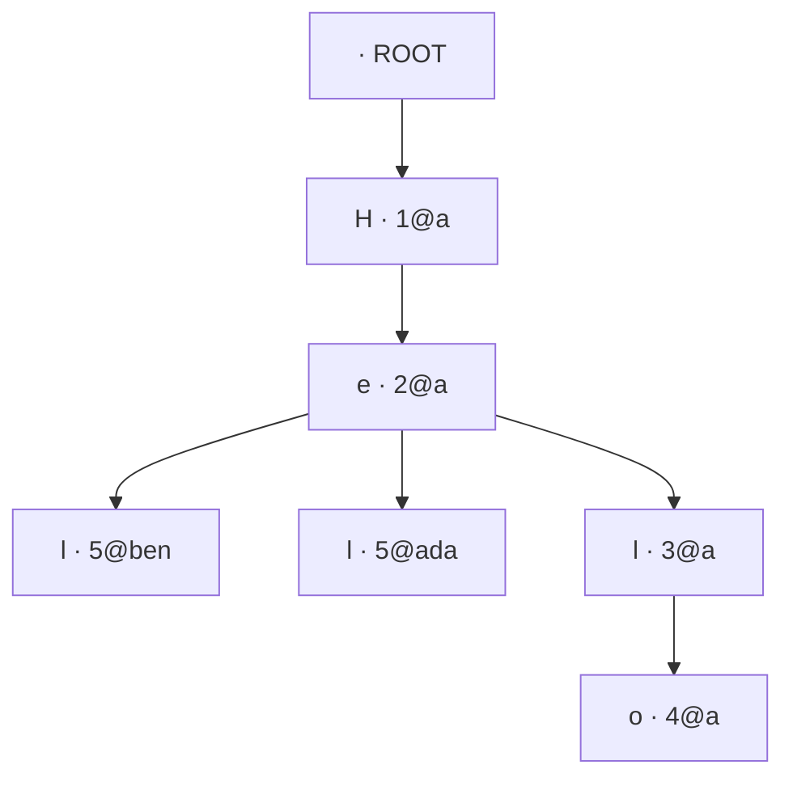

# @birga/crdt

A **from-scratch, dependency-free sequence CRDT** for text, with a property-based
test suite that *proves* convergence. This is the credibility core of Birga: the
merge logic is owned and understood, not imported.

```ts
import { RGA } from "@birga/crdt";

const alice = new RGA("alice");
const bob = new RGA("bob");

const a1 = alice.insertAt(0, "H");
const a2 = alice.insertAt(1, "i");
bob.applyAll([a1, a2]); // bob now reads "Hi"

// Both edit position 0 at the same time, offline:
const ax = alice.insertAt(0, "!");
const bx = bob.insertAt(0, "?");
alice.apply(bx);
bob.apply(ax);

alice.toString() === bob.toString(); // → true, always
```

## The model: a causal tree (an RGA)

Every character is a **node** with a globally-unique id `(replica, counter)` and a
`parent` — the id of the character it was typed after (`ROOT` at the start). Those
nodes form a tree. The document is the **pre-order depth-first traversal** of that
tree, with:

- **siblings ordered by id, descending** — a total, replica-independent order, so
  two clients that hold the same concurrent inserts always render them the same way;
- **tombstoned nodes skipped** — deletes never remove a node, they just hide it, so
  a concurrent insert *after* a deleted character still has a stable anchor.

The id counter is a **Lamport clock**: each replica keeps it ahead of the highest
counter it has seen, so ids issued after observing an op sort after it. The
`replica` component makes every id unique, even under concurrency.

Two replicas concurrently inserting after the same character both build this tree
and both read it the same way (siblings ordered by id, descending):



Pre-order traversal with descending sibling order (`5@ben` before `5@ada` before
`3@a`) yields the same string on every replica — the whole point. The full worked
example is in [docs/CRDT.md](../../docs/CRDT.md).

## Why it converges

The entire state is three **order-insensitive** structures:

| structure    | what it is                       | why order doesn't matter                     |
| ------------ | -------------------------------- | -------------------------------------------- |
| `nodes`      | a set of `id → node` from inserts | inserting an id twice is a no-op (idempotent) |
| `children`   | each parent's kids, sorted by id | a total order sorted incrementally is stable  |
| `tombstones` | a set of deleted ids             | set union is commutative + idempotent         |

A node is visible **iff** it is in `nodes` and not in `tombstones`, and the
traversal is a pure function of these three. So **any two replicas that have
applied the same *set* of operations — in any order, with any duplicates — produce
byte-identical text.** Delivery order is never required:

- a **delete before its insert** → the tombstone is remembered and applied when the
  insert lands;
- an **insert before its parent** → it waits in the parent's child bucket, invisible
  until the parent reconnects it to `ROOT`.

Everything self-heals once the full op set is present.

## The proof: property tests

`test/convergence.property.test.ts` uses [fast-check](https://github.com/dubzzz/fast-check)
to generate random multi-replica editing sessions (offline concurrency included) and
asserts, across hundreds of runs:

1. **Order independence** — the same op log, shuffled many ways, yields one document.
2. **Replica convergence** — replicas that edited offline all match after a full,
   randomly-ordered gossip; a fresh late joiner replaying the log matches too.
3. **Idempotence** — delivering every op twice changes nothing.
4. **Snapshot fidelity** — restore-then-continue equals never-snapshotted.

`test/rga.test.ts` pins the named hard cases: two concurrent inserts at one
position, insert into a deleted region, concurrent delete, offline reconciliation,
snapshot round-trip.

```bash
pnpm test        # run once
pnpm test:watch  # watch mode
pnpm build       # emit dist/ (types + sourcemaps)
```

## API

- `new RGA(replicaId)` — a replica.
- `insertAt(index, char) → InsertOp` / `deleteAt(index) → DeleteOp` — local edits;
  return the op to broadcast.
- `apply(op)` / `applyAll(ops)` — integrate remote or replayed ops (any order).
- `toString()`, `length` — read the document.
- `snapshot()` / `RGA.fromSnapshot(replicaId, snap)` — persistence + late joiners.

Zero runtime dependencies. `fast-check`, `vitest`, and `typescript` are dev-only.
